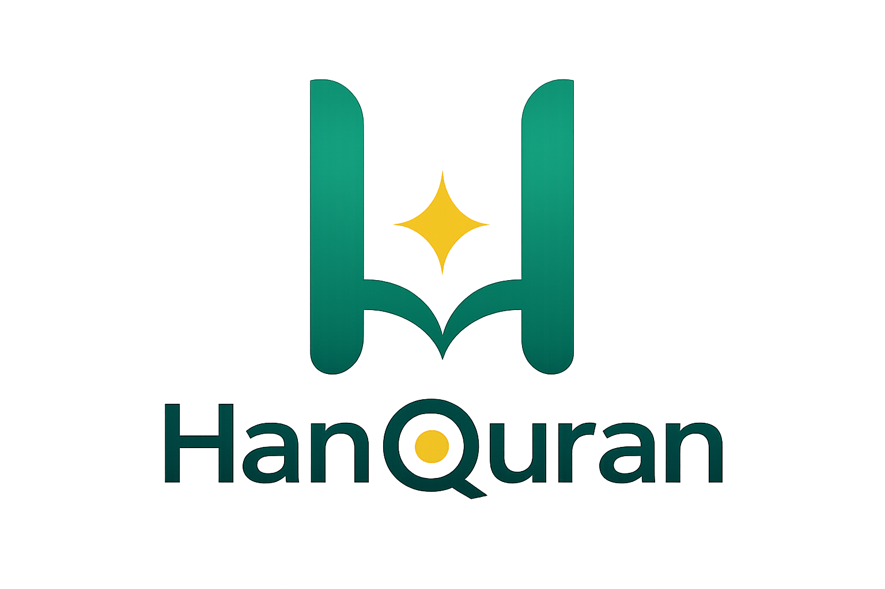

<p align="center">
  
</p>

**Platform hafalan Al-Qur'an** — source code publik, lisensi komunitas. Audio per ayat, repeat, mode fokus, dan dukungan offline. Tanpa akun. Mobile-first.

[](./LICENSE)
[](https://nextjs.org/)
[](https://www.typescriptlang.org/)
[](./tests)

Repository: [github.com/raqolbi/hanquran-app](https://github.com/raqolbi/hanquran-app)

---

## Tentang HanQuran

### Apa itu HanQuran?

HanQuran adalah aplikasi web (PWA) untuk **menghafal dan murojaah** Al-Qur'an. Bukan sekadar pembaca Quran — fokus utamanya adalah **pengulangan terpandu audio**, **mode baca bebas distraksi**, dan **pembelajaran yang dapat dilanjutkan** dari posisi terakhir.

### Tujuan project

Menjadi platform hafalan Al-Qur'an yang source code-nya terbuka untuk komunitas, dengan lisensi yang mendukung penggunaan non-komersial — termasuk penggunaan **offline** setelah konten diunduh. Visi lengkap: [`docs/00-vision.md`](./docs/00-vision.md).

### Filosofi produk

| Prinsip | Makna |
|---------|--------|
| **Memorization First** | Setiap keputusan produk dievaluasi: *apakah ini membantu menghafal?* |
| **Mobile First** | Dirancang untuk layar kecil dan sentuhan |
| **Offline First** | Setelah unduhan, aplikasi tidak bergantung pada internet |
| **Simplicity First** | Tanpa registrasi, tanpa login, tanpa konfigurasi rumit |

Alur inti yang dituju:

```text
Buka aplikasi → Pilih surat → Putar audio → Aktifkan repeat → Mode fokus → Hafal
```

### Fokus aplikasi

- Hafalan (tahfidz) dengan **repeat** ayat / range / seluruh surat
- Audio tilawah **per ayat**
- **Mode Fokus** — satu ayat, minim distraksi
- **Lanjutkan Hafalan** dari posisi terakhir
- Preferensi lokal (bahasa UI, qari, tampilan ayat, aksesibilitas)

### Status project saat ini

| Aspek | Keterangan |
|-------|------------|
| **Versi** | `0.1.0` (pre-release MVP) |
| **Scope** | MVP V1 dibekukan di [`docs/20-mvp-freeze.md`](./docs/20-mvp-freeze.md) |
| **Implementasi** | Core flows utama sudah berjalan; **belum** dinyatakan rilis MVP |
| **Pengujian** | 175 unit test (Vitest) |
| **Deploy** | Direncanakan di [Vercel](./docs/25-deployment-vercel.md) |

**Sudah diimplementasikan** (diverifikasi dari codebase): daftar 114 surat, detail surat, audio player, repeat engine, mode fokus, favorit surat, lanjutkan hafalan, i18n UI (`id` / `en`), unduh offline per surat, Service Worker, PWA (manifest, install prompt, offline shell, splash), Vercel Analytics.

**Belum selesai / di luar MVP V1** (dokumentasi resmi): word-by-word highlight, persist posisi audio, verifikasi E2E offline, error tracking produksi, seluruh kriteria rilis di [`docs/20-mvp-freeze.md`](./docs/20-mvp-freeze.md) §9.

---

## Daftar Isi

- [Screenshot](#screenshot)
- [Fitur](#fitur)
- [Tech Stack](#tech-stack)
- [Arsitektur](#arsitektur)
- [Struktur Folder](#struktur-folder)
- [Prasyarat](#prasyarat)
- [Instalasi](#instalasi)
- [Menjalankan Project](#menjalankan-project)
- [Environment Variables](#environment-variables)
- [Pengujian](#pengujian)
- [Deployment](#deployment)
- [Dokumentasi](#dokumentasi)
- [Komunitas & Kontribusi](#komunitas--kontribusi)
- [Credits](#credits)
- [Maintainer](#maintainer)
- [License](#license)

---

## Screenshot

Pratinjau antarmuka HanQuran (mobile-first, UI Bahasa Indonesia).

| Beranda — daftar surat | Detail surat |
| :---: | :---: |
|  |  |

| Mode Fokus — repeat ayat | Pengaturan |
| :---: | :---: |
|  |  |

---

## Fitur

### Pengguna

| Fitur | Deskripsi |
|-------|-----------|
| **Beranda** | 114 surat, pencarian, filter favorit, kartu Lanjutkan Hafalan |
| **Detail Surat** | Ayat Uthmani, terjemahan & transliterasi (toggle), audio, repeat, unduh offline |
| **Mode Fokus** | Satu ayat per layar, navigasi ayat, audio & repeat (tanpa word highlight di MVP) |
| **Pengaturan** | Bahasa UI, qari, ukuran teks Arab, kontras tinggi, animasi, status & hapus cache |
| **Offline** | Unduh audio per surat; Service Worker cache dataset & aset |
| **PWA** | Instal ke layar utama, splash screen, halaman fallback offline |

### Developer

| Fitur | Lokasi |
|-------|--------|
| Service layer Quran | `services/quran/` |
| Audio controller | `services/audio-controller.ts` |
| Repeat engine | `services/repeat-engine.ts` |
| State (Zustand) | `stores/` |
| Persistensi pengguna (Dexie) | `services/db/` |
| Custom analytics | `lib/analytics/` — lihat [`docs/analytics.md`](./docs/analytics.md) |

### Rute aplikasi

| Rute | Halaman |
|------|---------|
| `/` | Beranda |
| `/surah/[id]` | Detail surat (`?ayah=` opsional) |
| `/focus/[id]` | Mode fokus (`?ayah=` opsional) |
| `/settings` | Pengaturan |

Spesifikasi lengkap: [`docs/14-routing-spec.md`](./docs/14-routing-spec.md).

---

## Tech Stack

| Lapisan | Teknologi |
|---------|-----------|
| Framework | [Next.js 16](https://nextjs.org/) (App Router) |
| Bahasa | [TypeScript 5.7](https://www.typescriptlang.org/) |
| UI | [React 19](https://react.dev/), [Tailwind CSS 4](https://tailwindcss.com/), [shadcn/ui](https://ui.shadcn.com/) (`@base-ui/react`) |
| Animasi | [Motion](https://motion.dev/) |
| State runtime | [Zustand 5](https://zustand.docs.pmnd.rs/) |
| Persistensi | [Dexie 4](https://dexie.org/) (IndexedDB) |
| i18n UI | [next-intl 4](https://next-intl.dev/) — `id`, `en` |
| PWA | Service Worker (`public/sw.js`), Web App Manifest |
| Analytics | [@vercel/analytics](https://vercel.com/docs/analytics) |
| Testing | [Vitest 4](https://vitest.dev/) + Testing Library + jsdom |

Keputusan arsitektur dibekukan: [`docs/20-mvp-freeze.md`](./docs/20-mvp-freeze.md) Bagian 7.

---

## Arsitektur

### Konten Quran (static dataset)

```text
public/data/*  →  services/quran/*  →  hooks  →  UI
```

Konten Quran **tidak** disimpan di Dexie. Sumber kebenaran: dataset statis di `public/data/`. Detail: [`docs/23-static-dataset-architecture.md`](./docs/23-static-dataset-architecture.md).

### Data pengguna

```text
UI  →  Zustand stores  →  Dexie (settings, favorites, lastRead, downloadManifest)
```

### Audio

```text
CDN tilawah (everyayah.com)  →  AudioController  →  HTMLAudioElement
                                      ↓
                              Cache Storage (Service Worker)
```

### Offline & PWA

- **Service Worker:** `hanquran-static-v1`, `hanquran-shell-v1`, `hanquran-data-v1`, `hanquran-audio-v1`
- **Registrasi SW:** production only — `lib/register-service-worker.ts`

> **Penting:** PWA dan Service Worker **tidak aktif** di `npm run dev`. Uji dengan `npm run build && npm start` atau deployment Vercel.

---

## Struktur Folder

```text
hanquran-app/
├── app/                 # Next.js App Router (halaman & layout)
├── components/          # UI layar, shared, primitives (ui/)
├── hooks/               # Custom React hooks
├── lib/                 # Utilitas, analytics, routes, PWA helpers
├── services/            # Quran loader, audio, repeat, download, db
├── stores/              # Zustand (audio, user, repeat, offline)
├── types/               # TypeScript types domain
├── i18n/                # Konfigurasi next-intl
├── messages/            # String UI (id.json, en.json)
├── data/                # reciters.json (metadata qari)
├── public/
│   ├── data/            # Dataset Quran & terjemahan (114 surat)
│   ├── sw.js            # Service Worker
│   ├── manifest.json    # PWA manifest
│   └── branding/        # Logo
├── tests/               # Unit & integration tests (Vitest)
└── docs/                # Dokumentasi proyek (vision, spec, tasks, …)
```

Referensi lengkap: [`docs/16-folder-structure.md`](./docs/16-folder-structure.md).

---

## Prasyarat

| Tool | Versi minimum |
|------|---------------|
| Node.js | 20 LTS |
| npm | 10 |

---

## Instalasi

```bash
git clone git@github.com:raqolbi/hanquran-app.git
cd hanquran-app
npm install
```

MVP **tidak memerlukan** kredensial API eksternal. Konten Quran dari `public/data/*`; audio dari CDN tilawah; daftar qari dari `data/reciters.json`.

Panduan developer lengkap: [`docs/SETUP.md`](./docs/SETUP.md).

---

## Menjalankan Project

| Perintah | Fungsi |
|----------|--------|
| `npm run dev` | Dev server di http://localhost:3000 |
| `npm run build` | Build produksi |
| `npm run start` | Jalankan build produksi |
| `npm run test` | Unit & integration tests |
| `npm run test:watch` | Tests mode watch |
| `npm run lint` | ESLint |

---

## Environment Variables

MVP **tidak mewajibkan** environment variable. File contoh: [`.env.example`](./.env.example).

```bash
# Opsional — salin jika diperlukan di masa depan
cp .env.example .env.local
```

Variabel khusus (mis. Sentry) dapat ditambahkan saat Phase 8 release monitoring diimplementasikan — lihat [`docs/18-development-tasks.md`](./docs/18-development-tasks.md).

---

## Pengujian

```bash
npm run test
```

- **175 test** di `tests/` (Vitest + jsdom + fake-indexeddb)
- Konfigurasi: `vitest.config.ts`, setup: `tests/setup.ts`

---

## Deployment

HanQuran direncanakan di-host di **Vercel**:

- **Production:** branch `main`
- **Preview:** otomatis per PR / push branch
- **Staging opsional:** branch `staging` + subdomain

Panduan lengkap, checklist QA, dan rollback: [`docs/25-deployment-vercel.md`](./docs/25-deployment-vercel.md).

Catatan rilis: [`RELEASE.md`](./RELEASE.md).

---

## Dokumentasi

| Dokumen | Isi |
|---------|-----|
| [`docs/00-vision.md`](./docs/00-vision.md) | Visi, misi, positioning |
| [`docs/20-mvp-freeze.md`](./docs/20-mvp-freeze.md) | Scope MVP V1 (dibekukan) |
| [`docs/SETUP.md`](./docs/SETUP.md) | Setup developer |
| [`docs/18-development-tasks.md`](./docs/18-development-tasks.md) | Backlog & progress implementasi |
| [`docs/14-routing-spec.md`](./docs/14-routing-spec.md) | Spesifikasi rute |
| [`docs/15-state-management.md`](./docs/15-state-management.md) | State & persistensi |
| [`docs/07-api-integration.md`](./docs/07-api-integration.md) | Sumber data & integrasi |
| [`docs/analytics.md`](./docs/analytics.md) | Event Vercel Analytics |
| [`CLAUDE.md`](./CLAUDE.md) | Konvensi penulisan kode & dokumen |

---

## Komunitas & Kontribusi

### Model lisensi & kontribusi

Source code HanQuran tersedia secara publik di GitHub di bawah
**[HanQuran Community License v1.0](./LICENSE) (HCCL)** — gratis untuk
penggunaan non-komersial; penggunaan komersial memerlukan izin tertulis
(lihat [`COMMERCIAL-LICENSE.md`](./COMMERCIAL-LICENSE.md)).

Repository menerima kontribusi komunitas: fork, modifikasi untuk penggunaan
non-komersial, dan pull request sesuai HCCL.

### Melaporkan bug

1. Cek [Issues](https://github.com/raqolbi/hanquran-app/issues) yang sudah ada.
2. Buat issue baru dengan:
   - Langkah reproduksi
   - Perilaku yang diharapkan vs aktual
   - Browser / perangkat (terutama untuk audio, PWA, offline)
   - Screenshot atau log jika relevan

### Mengajukan feature request

1. Baca scope MVP di [`docs/20-mvp-freeze.md`](./docs/20-mvp-freeze.md) — fitur di luar scope diklasifikasikan Post-MVP / Growth / Future Vision.
2. Buka [GitHub Issue](https://github.com/raqolbi/hanquran-app/issues) dengan label atau judul yang jelas menjelaskan masalah pengguna dan manfaat hafalan.

### Berkontribusi (kode)

1. Fork repository & buat branch fitur.
2. Ikuti konvensi di [`CLAUDE.md`](./CLAUDE.md) (Bahasa Indonesia untuk UI & docs; nama kode tetap Inggris).
3. Pastikan `npm run test` dan `npm run build` lulus.
4. Buka Pull Request ke `main` dengan deskripsi perubahan dan tautan ke task di [`docs/18-development-tasks.md`](./docs/18-development-tasks.md) jika ada.

Belum ada `CONTRIBUTING.md` terpisah; panduan ini dan `docs/SETUP.md` menjadi referensi sementara.

---

## Credits

Sumber eksternal dan library yang **benar-benar dipakai** oleh project:

### Data & audio

| Sumber | Penggunaan |
|--------|------------|
| **Dataset statis `public/data/`** | Teks Arab Uthmani, metadata surat, terjemahan `id` & `en` (manifest v1.0.0, 114 surat / 6236 ayat) |
| **[EveryAyah](https://everyayah.com/)** | CDN audio tilawah per ayat (`AYAH_AUDIO_BASE_URL` di `services/quran/audio-config.ts`) |
| **`data/reciters.json`** | Metadata qari yang didukung (slug CDN + nama tampilan) |

### Framework & library utama

Next.js · React · TypeScript · Tailwind CSS · shadcn/ui · Zustand · Dexie · next-intl · Motion · Lucide React · Vitest

### Infrastruktur

| Layanan | Penggunaan |
|---------|------------|
| **[Vercel](https://vercel.com/)** | Hosting & deployment (direncanakan) |
| **Vercel Analytics** | Page views & custom events produksi |

### Branding

Aset logo di `public/branding/` — komponen [`components/shared/Logo.tsx`](./components/shared/Logo.tsx).

---

## Maintainer

| | |
|---|---|
| **Repository** | [github.com/raqolbi/hanquran-app](https://github.com/raqolbi/hanquran-app) |
| **Maintainer** | [Ramadian (@raqolbi)](https://github.com/raqolbi) |

---

## License

HanQuran is licensed under the **[HanQuran Community License v1.0](./LICENSE)** (HCCL).

| Penggunaan | Izin |
|------------|------|
| Pribadi, pendidikan, riset | ✅ Gratis (non-komersial) |
| Masjid, sekolah Islam, lembaga keagamaan, nirlaba | ✅ Gratis (non-komersial) |
| Fork, modifikasi, self-host non-komersial, kontribusi PR | ✅ Sesuai HCCL |
| SaaS, aplikasi berbayar, white-label, redistribusi komersial, dll. | ❌ Memerlukan **izin tertulis** — lihat [`COMMERCIAL-LICENSE.md`](./COMMERCIAL-LICENSE.md) |

Dengan menggunakan atau mendistribusikan software ini, Anda setuju pada ketentuan
di `LICENSE`. Software disediakan **"as is"** tanpa garansi.

Pertanyaan lisensi komersial: buka issue atau hubungi maintainer melalui
[github.com/raqolbi/hanquran-app](https://github.com/raqolbi/hanquran-app).

---

<p align="center">
  <strong>HanQuran</strong> — Read, Listen, Memorize.
</p>
