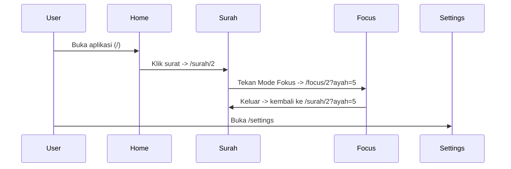

# 14 — Spesifikasi Routing HanQuran

Dokumen ini mendokumentasikan seluruh rute aplikasi HanQuran (App Router Next.js). Ditujukan untuk developer baru agar memahami URL, tujuan halaman, komponen utama, dan aksi yang dapat dilakukan pengguna.

Semua penjelasan menggunakan Bahasa Indonesia dan mengikuti implementasi saat ini di folder `hanquran-app`.

---

**Catatan teknis**
- Routing mengikuti Next.js App Router (folder `app/`).
- Helper route tersedia di `lib/routes.ts` dan harus dipakai untuk membuat link agar perubahan shape route terpusat.

---

## Ringkasan rute yang ada (implementasi saat ini)

1. URL: `/`
   - Nama halaman: Home (Beranda)
   - Tujuan: Menampilkan daftar surat, pencarian, filter favorit, dan kartu "Lanjutkan Hafalan".
   - Komponen utama: `Header`, `ContinueReading`, `SearchInput`, `FilterChips`, daftar `SurahCard`.
   - Aksi pengguna: Cari surat, buka halaman surat, tandai favorit, navigasi ke pengaturan.

2. URL: `/surah/[id]` (contoh: `/surah/2`)
   - Nama halaman: Surah Detail
   - Tujuan: Menampilkan seluruh ayat sebuah surat, kontrol audio, dan opsi repeat/fokus.
   - Komponen utama: `SurahDetailHeader`, `VerseDisplayControls`, daftar `AyahCard`, `AudioPlayer`, `RepeatSelector`, `RepeatSettingsDialog`.
   - Aksi pengguna: Pilih ayat aktif, putar / jeda audio, lompat ayat, toggle Terjemahan/Transliterasi, buka Mode Fokus, buka pengaturan repeat, tandai favorit.
   - Query opsional: `?ayah=<number>` untuk membuka halaman pada ayat tertentu.

3. URL: `/focus/[id]` (contoh: `/focus/2`)
   - Nama halaman: Focus Mode (Mode Fokus)
   - Tujuan: Layar baca bebas distraksi — satu ayat nyata (Arab + transliterasi/terjemahan sesuai preferensi). **Tanpa** word-by-word highlight pada MVP V1 (`docs/24-focus-mode-mvp-scope.md`).
   - Komponen utama: teks ayat, `FocusModePlayer`, `RepeatStatus`, `RepeatSettingsDialog`.
   - Aksi pengguna: Putar/jeda audio ayat, navigasi ayat sebelumnya/berikutnya, buka pengaturan repeat, keluar ke halaman surah.
   - Query opsional: `?ayah=<number>` untuk memulai dari ayat tertentu.

4. URL: `/settings`
   - Nama halaman: Pengaturan
   - Tujuan: Menyediakan konfigurasi aplikasi seperti pilihan qari, ukuran teks, status offline/cache, dan aksesibilitas.
   - Komponen utama: `SettingsHeader`, `SettingsSection`, `SettingsRow`, `OfflineStatusBadge`, primitives (`Select`, `Switch`, `SegmentedControl`).
   - Aksi pengguna: Ubah qari, ubah preferensi tampilan, hapus cache, lihat status offline.

---

## Rute yang direkomendasikan untuk MVP (belum ada / perlu penambahan)

Catatan: rekomendasi hanya mencakup fitur yang sesuai wireframe / high-fidelity / component spec.

- `/favorites`
  - Tujuan: Halaman yang menampilkan semua surat favorit pengguna (mempermudah navigasi dan manajemen favorit).
  - Komponen utama: ulang `SurahCard` list, `Header`, kemampuan mengurutkan / hapus favorit.
  - Kenapa direkomendasikan: memisahkan daftar favorit meningkatkan discoverability dan UX.

- `/search` (opsional sebagai route; saat ini pencarian berada di Home)
  - Tujuan: Halaman pencarian penuh dengan hasil terfilter dan opsi lanjutan.
  - Komponen utama: `SearchInput`, hasil `SurahCard` dan highlight kata, filter lanjutan.
  - Kenapa: jika fitur pencarian diperluas, halaman khusus membantu UX dan history.

- `/offline` (status & manajemen cache)
  - Tujuan: Halaman yang menunjukkan detail status offline, progress unduhan, dan pengelolaan cache.
  - Komponen utama: `OfflineStatusBadge`, kontrol unduh / batalkan, daftar file audio yang tersimpan.
  - Kenapa: memberi transparency dan kontrol bagi pengguna offline-first.

- `/profile` (opsional untuk user-specific data)
  - Tujuan: Menyimpan preferensi pengguna, sinkronisasi (jika ada), dan data kemajuan hafalan.

---

## Diagram Hierarki Route (Mermaid)

```mermaid
flowchart TB
  A[Home (/)] --> B[Surah Detail (/surah/[id])]
  B --> C[Focus Mode (/focus/[id])]
  A --> D[Settings (/settings)]
  A --> E[Favorites (recommended)]
  A --> F[Search (optional)]
  D --> G[Offline Management (recommended /offline)]
```

---

## Diagram Alur Navigasi (Mermaid) — skenario umum



---

## Tabel Hubungan Antar Halaman

| Halaman Sumber | Aksi | Target / Route | Catatan |
|---|---:|---|---|
| `Home` | Klik Surah | `/surah/[id]` | default navigasi dari `SurahCard` menggunakan `routes.surah()` |
| `Home` | Lanjutkan Hafalan | `/surah/[id]?ayah=` | Link dari `ContinueReading` |
| `SurahDetail` | Mode Fokus | `/focus/[id]?ayah=` | `VerseDisplayControls` (tombol Fokus) memicu `routes.focus()` |
| `SurahDetail` | Buka Repeat Settings | dialog lokal | `RepeatSettingsDialog` (Dialog/Drawer) |
| `FocusMode` | Keluar | `/surah/[id]?ayah=` | router.push(routes.surah(...)) |
| Global/Header | Pengaturan | `/settings` | Link dari `Header` (ikon) |

---

## Validasi konsistensi

- App Router: rute diimplementasikan melalui folder `app/` — sesuai dengan App Router Next.js.
- Helper: `lib/routes.ts` berisi pembangun route (`home`, `settings`, `surah`, `focus`) — gunakan helper ini untuk konsistensi.
- **Locale UI:** MVP mempertahankan route tanpa prefix locale (`/settings`, bukan `/id/settings`). Bahasa UI dari `settings.appLocale` + `next-intl` — lihat `docs/21-i18n-and-locale.md`.
- Wireframe / High-Fidelity / Component Spec:
  - Daftar rute di atas konsisten dengan halaman yang terdapat di `app/` dan komponen yang digunakan dalam wireframe/high-fidelity (mis. `Focus Mode`, `Surah Detail`, `Settings`).
  - Repeat UI dan audio player ditempatkan sesuai spes (RepeatControls pada SurahDetail + dialog, FocusMode memiliki player minimal).

Jika Anda ingin saya jalankan verifikasi lebih teknis (mis. memeriksa semua `Link`/`href` di codebase agar memakai `routes` helper), saya bisa menjalankan pencarian kode untuk memastikan.

---

## File Referensi implementasi
- `app/page.tsx` — Home
- `app/surah/[id]/page.tsx` — Surah Detail
- `app/focus/[id]/page.tsx` — Focus Mode
- `app/settings/page.tsx` — Settings
- `lib/routes.ts` — route helpers

---

Dokumen ini disimpan di `docs/14-routing-spec.md`.
