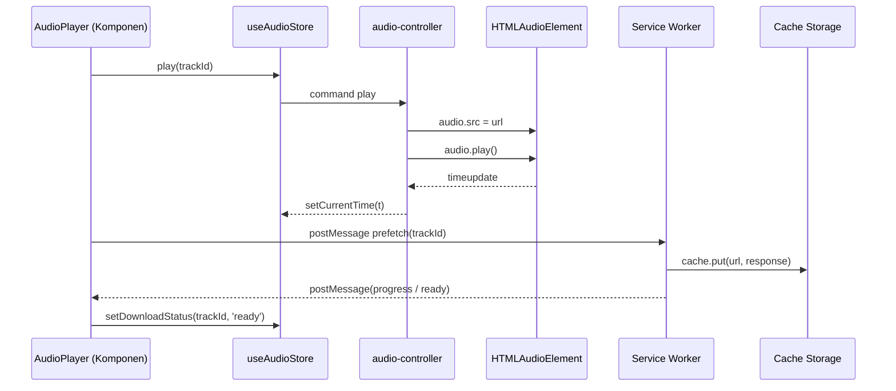
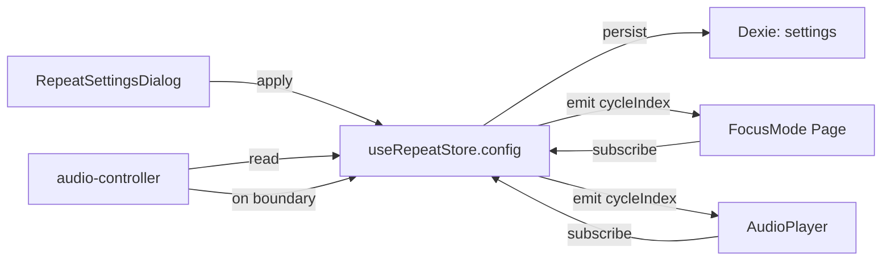
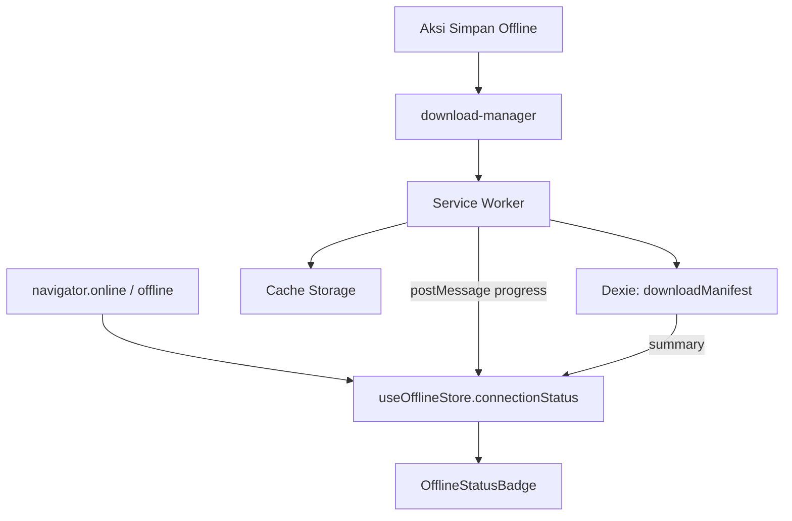
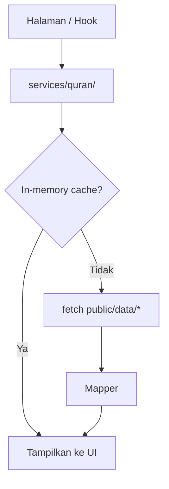
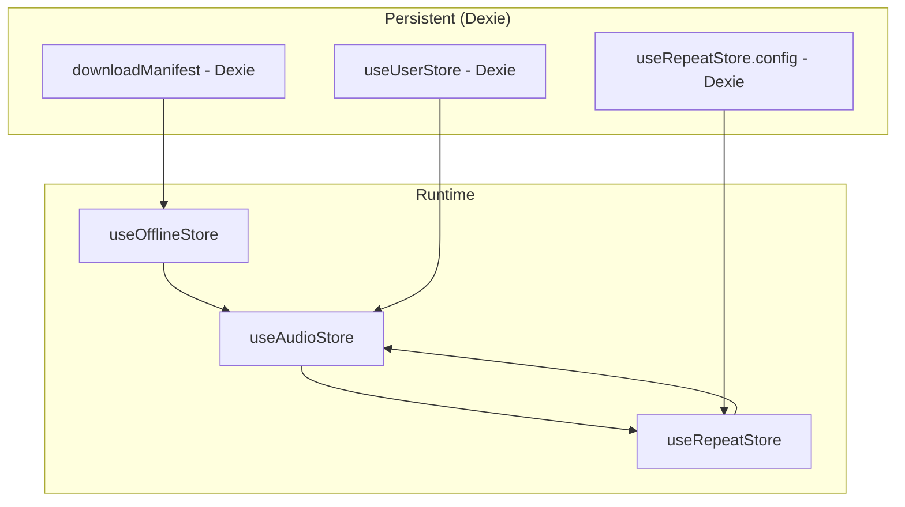

# 15 — Arsitektur State Management HanQuran

Dokumen ini adalah **single source of truth** untuk seluruh state pada aplikasi HanQuran V1. Setiap keputusan di sini bersifat **final untuk MVP** dan menggantikan rekomendasi pada dokumen sebelumnya jika terjadi ambiguitas.

Penjelasan menggunakan Bahasa Indonesia. Nama file, nama store, nama hook, dan kode program tetap dalam bahasa aslinya sesuai `CLAUDE.md`.

Prinsip arsitektur yang diikuti:

1. Memorization First
2. Mobile First
3. Offline First
4. Static Dataset First (konten Quran dari `public/data/*`, bukan Dexie)

---

# 1. Keputusan Arsitektur Final

Keputusan berikut **final untuk MVP**. Tidak ada alternatif yang diperbolehkan. Setiap state baru yang muncul setelah MVP wajib dipetakan ke salah satu dari lima lapisan ini.

| # | Lapisan State          | Teknologi Resmi          | Pemakaian Utama                                              |
| - | ---------------------- | ------------------------ | ------------------------------------------------------------ |
| 1 | Runtime State          | Zustand                  | State client yang sering berubah dan diakses lintas komponen |
| 2 | Persistent State       | **Dexie** (IndexedDB)    | Preferensi, favorit, progress hafalan, manifest cache        |
| 3 | Audio Files            | Cache Storage            | File audio biner yang dikelola Service Worker                |
| 4 | Route State            | URL Parameter            | Lokasi navigasi (surat aktif, ayat aktif)                    |
| 5 | Temporary UI State     | React Local State        | UI ephemeral pada satu komponen                              |

Aturan turunan:

* Semua persistent state berjalan di atas **Dexie** (driver IndexedDB). Tidak ada lapisan persistensi lain di MVP.
* Runtime state berjalan di atas **Zustand**. Tidak ada wadah runtime lain di MVP.
* File audio biner **hanya** disimpan di `Cache Storage` melalui Service Worker, bukan di Dexie maupun lapisan lain.
* Surat aktif dan ayat aktif **selalu** dibaca dari URL — bukan dari runtime state.
* State ephemeral yang tidak dibutuhkan komponen lain wajib tinggal di komponen pemiliknya melalui `useState` / `useReducer`.

Konsekuensi:

* Tidak ada keputusan ad-hoc memilih wadah penyimpanan saat implementasi.
* Setiap PR yang memperkenalkan state baru harus menambah baris pada Tabel Master State di Bagian 8.

---

# 2. Klasifikasi Seluruh State Aplikasi

State aplikasi dibagi ke lima lapisan pada Bagian 1.

## 2.1 Runtime State (Zustand)

State client yang sering berubah dan diakses lintas komponen.

* Status pemutaran audio: `isPlaying`, `currentTime`, `duration`, `currentTrack`.
* Status repeat runtime: `cycleIndex`, `isRepeatActive`, `lastBoundary`.
* Status koneksi: `connectionStatus` (`online` / `offline`).
* Status unduhan audio per-track: `pending` / `downloading` / `ready` / `failed`.

## 2.2 Persistent State (Dexie)

Preferensi pengguna dan data yang harus bertahan antar sesi atau saat offline. Disimpan di IndexedDB melalui **Dexie**.

* Daftar favorit — tabel `favorites`.
* Pengaturan qari — tabel `settings`.
* Bahasa UI aplikasi (`appLocale`: `id` | `en`) — tabel `settings`; framework `next-intl`.
* Pengaturan ukuran teks Arab — tabel `settings`.
* Toggle terjemahan — tabel `settings` (`translationVisible`); kontrol UI di `VerseDisplayControls`.
* Toggle transliterasi — tabel `settings` (`transliterationVisible`); kontrol UI di `VerseDisplayControls`.
* Aksesibilitas (`contrastMode`, `smoothAnimation`) — tabel `settings`; diterapkan via `AccessibilityProvider`.
* Playback (`autoFollowPlayback`) — tabel `settings`; mengatur auto scroll ayat aktif di Surah Detail. Lihat `docs/28-playback-settings.md`.
* Konfigurasi repeat (`count`, `target`, `range`) — tabel `settings`.
* Penanda Lanjutkan Hafalan (`lastViewed`) — tabel `lastRead`.
* Manifest cache audio — tabel `downloadManifest`.
* Progress hafalan — tabel `memorization_progress` (Growth Phase).

> **Konten Quran** (surat, ayat, terjemahan) **tidak** disimpan di Dexie — lihat `docs/23-static-dataset-architecture.md`.

## 2.3 Audio Files (Cache Storage)

File audio biner ayat per ayat dikelola Service Worker melalui `Cache Storage` API. Nama cache standar: `hanquran-audio-v1`. Service Worker adalah **satu-satunya** pihak yang menulis dan menghapus file di cache ini.

## 2.4 Route State (URL Parameter)

Lokasi navigasi pengguna berada di URL sehingga konsisten lintas tab, dapat dibagikan, dan tahan refresh.

* Surat aktif → segmen `/surah/[id]` dan `/focus/[id]`.
* Ayat aktif → query `?ayah=<number>`.
* Halaman pengaturan → `/settings`.

Helper pembuat URL: `lib/routes.ts` (`routes.home`, `routes.surah`, `routes.focus`, `routes.settings`).

## 2.5 Temporary UI State (React Local State)

State ephemeral yang **tidak** dipakai komponen lain. Hidup di komponen pemiliknya melalui `useState` / `useReducer`.

* Query pencarian di Beranda (`SearchInput`).
* Filter chips di Beranda (`FilterChips`).
* State buka/tutup dialog (`RepeatSettingsDialog`, `ClearCacheDialog`).
* State pratinjau ukuran teks pada Pengaturan.
* `activeWordIndex` pada Mode Fokus selama belum dibutuhkan komponen lain.
* Status hover / fokus tombol.

---

# 3. Pemilik State (Store Ownership)

Empat store Zustand resmi pada MVP. Tidak ada store tambahan yang boleh dibuat tanpa keputusan eksplisit di dokumen ini.

| Store              | File                       | Tanggung Jawab                                                                                  |
| ------------------ | -------------------------- | ----------------------------------------------------------------------------------------------- |
| `useAudioStore`    | `stores/audioStore.ts`     | Pemutaran audio: `isPlaying`, `currentTrack`, `currentTime`, `duration`, `seek/play/pause` actions |
| `useRepeatStore`   | `stores/repeatStore.ts`    | Konfigurasi & runtime repeat: `config` (persisten di Dexie), `cycleIndex`, `isActive` (runtime) |
| `useUserStore`     | `stores/userStore.ts`      | Preferensi pengguna: favorit, qari, textSize, terjemahan, aksesibilitas, lastViewed (persisten di Dexie) |
| `useOfflineStore`  | `stores/offlineStore.ts`   | `connectionStatus`, `downloadStatuses` per-track, ringkasan manifest yang dibaca dari Dexie     |

Pemilik state non-store:

| Pemilik                          | Tanggung Jawab                                                                |
| -------------------------------- | ----------------------------------------------------------------------------- |
| Next.js Router                   | Surat aktif dan ayat aktif (URL Parameter)                                    |
| Service Worker                   | File audio di Cache Storage dan progres unduhan                               |
| Komponen lokal                   | Temporary UI State (dialog terbuka, query pencarian, dst.)                    |
| `services/audio-controller.ts`   | Jembatan antara HTMLAudioElement dengan `useAudioStore`                       |
| `services/media-session.ts`      | Media Session API — metadata lock screen & action handlers Play/Pause         |
| `services/download-manager.ts`   | Antarmuka client ↔ Service Worker untuk unduhan audio                          |

Aturan kepemilikan:

* Komponen presentational (mis. `AudioPlayer`, `RepeatStatus`) **tidak** memiliki state global — mereka menerima props atau membaca store via selector.
* Setiap mutasi store wajib lewat action store. Komponen tidak boleh `set(...)` langsung dari luar.
* Aksi yang berdampak pada platform (audio element, Cache Storage) **wajib** melewati service layer (`audio-controller`, `download-manager`, `services/quran/`).

---

# 4. Lokasi Penyimpanan

| Lapisan            | Lokasi Fisik          | Mekanisme Akses                                  | Skop                            |
| ------------------ | --------------------- | ------------------------------------------------ | ------------------------------- |
| Runtime State      | Memori tab            | `Zustand` store hooks                            | Per-tab, in-memory              |
| Persistent State   | IndexedDB             | **Dexie** via Repository / action store          | Per-origin, lintas tab          |
| Audio Files        | Cache Storage         | Service Worker pada cache `hanquran-audio-v1`    | Per-origin, lintas tab          |
| Route State        | URL                   | `usePathname` / `useSearchParams`                | Per-tab, dibagi via tautan      |
| Temporary UI State | Memori komponen       | `useState` / `useReducer`                        | Per-mount komponen              |

Catatan implementasi:

* **Dexie** di-inisialisasi sekali di `services/db/db.ts`. Schema version dan migrasi dikelola di file yang sama.
* Store Zustand membaca dari Dexie saat inisialisasi (`init()` action), dan menulis ke Dexie saat ada perubahan yang perlu dipersist.
* `Cache Storage` diakses **hanya** dari Service Worker. Main thread memverifikasi keberadaan file via `caches.match(url)` ketika perlu, tetapi tidak menulis langsung.
* URL Parameter dibaca via `usePathname` / `useSearchParams` dari `next/navigation`.

---

# 5. Siklus Hidup State

## 5.1 Runtime State (Zustand)

* Lahir: saat tab dibuka dan store di-instantiate.
* Hidup: selama tab aktif. Antar route tetap hidup karena store berada pada root `layout.tsx`.
* Hilang: ketika tab ditutup atau direfresh.
* Rehidrasi: pada `app start`, store memanggil `init()` untuk membaca data persisten dari Dexie.

## 5.2 Persistent State (Dexie)

* Lahir: saat user pertama berinteraksi (mis. menandai favorit, mengubah pengaturan).
* Hidup: bertahan tanpa batas hingga user menghapus data situs atau menekan **Hapus Cache** di Pengaturan.
* Sinkronisasi: perubahan di-broadcast ke tab lain (lihat Bagian 9).
* Migrasi: dijaga oleh Dexie `db.version(N)`. Setting yang belum ada nilainya memakai default deklaratif.

## 5.3 Audio Files (Cache Storage)

* Lahir: ketika Service Worker menerima permintaan prefetch (mis. user menekan **Simpan Offline**) atau saat audio diputar pertama kali dengan strategi runtime caching.
* Hidup: hingga manifest mengeluarkannya atau user **Hapus Cache**.
* Pengukuran: ukuran cache di-ringkas oleh Service Worker dan dipublikasikan ke `useOfflineStore` via `postMessage`.

## 5.4 Route State (URL Parameter)

* Lahir: ketika user navigasi (klik tautan, `router.push`, ketik URL).
* Hidup: selama URL tidak berubah.
* Validasi: parameter `?ayah` divalidasi terhadap jumlah ayat surat; nilai invalid di-fallback ke ayat 1.

## 5.5 Temporary UI State (React Local State)

* Lahir: saat komponen mount.
* Hilang: saat komponen unmount atau parent re-mount.
* Tidak boleh dipromosikan ke store kecuali ada konsumen kedua di komponen lain.

---

# 6. Persistensi State

## 6.1 Mekanisme

Persistensi memakai **Dexie** langsung dari action store. Tidak menggunakan Zustand persist middleware.

Pola yang digunakan:

```ts
// stores/userStore.ts
const useUserStore = create<UserState>()((set, get) => ({
  favorites: [] as number[],
  settings: null as SettingsRecord | null,

  // Baca dari Dexie saat app start
  init: async () => {
    const settings = await db.settings.get('default');
    const favorites = await db.favorites.toArray();
    set({
      settings: settings ?? defaultSettings,
      favorites: favorites.map(f => f.surahId),
    });
  },

  // Tulis ke Dexie saat state berubah
  toggleFavorite: async (surahId: number) => {
    const favorites = get().favorites;
    if (favorites.includes(surahId)) {
      await db.favorites.delete(surahId);
      set({ favorites: favorites.filter(id => id !== surahId) });
    } else {
      await db.favorites.put({ surahId, createdAt: Date.now() });
      set({ favorites: [...favorites, surahId] });
    }
  },

  updateSettings: async (patch: Partial<SettingsRecord>) => {
    const current = get().settings ?? defaultSettings;
    const next = { ...current, ...patch, updatedAt: Date.now() };
    await db.settings.put(next);
    set({ settings: next });
  },
}));
```

## 6.2 Apa yang dipersist

| Store              | Data yang dipersist di Dexie                                                                 | Data runtime (tidak dipersist)           |
| ------------------ | --------------------------------------------------------------------------------------------- | ---------------------------------------- |
| `useUserStore`     | `favorites` (tabel `favorites`), seluruh settings (tabel `settings`), `lastViewed` (tabel `lastRead`) | —                                        |
| `useRepeatStore`   | `config` (`count`, `target`, `range`) di tabel `settings`                                    | `cycleIndex`, `isActive`                 |
| `useAudioStore`    | —                                                                                             | seluruh slice runtime                    |
| `useOfflineStore`  | `downloadManifest` (tabel `downloadManifest` Dexie)                                          | `connectionStatus`, `downloadStatuses`   |

## 6.3 Tabel Dexie yang Digunakan Store

| Store              | Tabel Dexie            |
| ------------------ | ---------------------- |
| `useUserStore`     | `settings`, `favorites`, `lastRead` |
| `useRepeatStore`   | `settings` (field repeatConfig) |
| `useOfflineStore`  | `downloadManifest`     |

> Tabel konten Quran (`surahs`, `ayahs`, dll.) **dihapus** dari schema Dexie v2.

## 6.4 Hapus Cache

Aksi **Hapus Cache** di Pengaturan harus menghapus:

1. Seluruh entri di Cache Storage `hanquran-audio-v1` (via Service Worker).
2. Tabel `downloadManifest` di Dexie.
3. **Tidak** menghapus preferensi pengguna: `settings`, `favorites`, `lastRead`.

---

# 7. Diagram Alur State

## 7.1 Alur State Pemutaran Audio



## 7.2 Alur State Repeat



## 7.3 Alur State Offline



## 7.4 Alur Muat Konten Quran (Static Dataset)



---

# 8. Tabel Master State

Tabel ini adalah daftar lengkap state pada MVP. Setiap penambahan state wajib memperbarui tabel ini.

| State                              | Lokasi             | Persisten | Teknologi          |
| ---------------------------------- | ------------------ | --------- | ------------------ |
| Surat aktif                        | URL Parameter      | Tidak     | URL Parameter      |
| Ayat aktif (`?ayah`)               | URL Parameter      | Tidak     | URL Parameter      |
| Lanjutkan Hafalan (`lastViewed`)   | IndexedDB          | Ya        | Dexie (`lastRead`) |
| Status pemutaran audio             | Zustand            | Tidak     | Zustand            |
| Track audio aktif                  | Zustand            | Tidak     | Zustand            |
| Posisi waktu audio                 | Zustand            | Tidak     | Zustand            |
| Status unduhan per-track           | Zustand            | Tidak     | Zustand            |
| Konfigurasi repeat                 | IndexedDB          | Ya        | Dexie (`settings`) |
| Runtime repeat (`cycleIndex`)      | Zustand            | Tidak     | Zustand            |
| Daftar favorit                     | IndexedDB          | Ya        | Dexie (`favorites`)|
| Pengaturan qari                    | IndexedDB          | Ya        | Dexie (`settings`) |
| Bahasa UI (`appLocale`)            | IndexedDB          | Ya        | Dexie (`settings`) |
| Pengaturan ukuran teks Arab        | IndexedDB          | Ya        | Dexie (`settings`) |
| Toggle terjemahan                  | IndexedDB          | Ya        | Dexie (`settings.translationVisible`) |
| Toggle transliterasi               | IndexedDB          | Ya        | Dexie (`settings.transliterationVisible`) |
| Kontras tinggi                     | IndexedDB          | Ya        | Dexie (`settings`) |
| Animasi halus                      | IndexedDB          | Ya        | Dexie (`settings`) |
| Status koneksi                     | Zustand            | Tidak     | Zustand            |
| Manifest cache audio               | IndexedDB          | Ya        | Dexie (`downloadManifest`) |
| File audio biner                   | Cache Storage      | Ya        | Cache Storage      |
| Konten Quran (surat, ayat, terjemahan) | `public/data/*` via `services/quran/` | Tidak (fetch + in-memory) | Static files + HTTP cache |
| Word timings | Field di JSON surat | Tidak | Sama dengan konten Quran |
| `activeWordIndex` Mode Fokus       | React Local State  | Tidak     | React Local State  |
| Query pencarian Beranda            | React Local State  | Tidak     | React Local State  |
| Filter chips Beranda               | React Local State  | Tidak     | React Local State  |
| Dialog terbuka (Repeat / Cache)    | React Local State  | Tidak     | React Local State  |
| Pratinjau ukuran teks Pengaturan   | React Local State  | Tidak     | React Local State  |

---

# 9. Relasi Antar Store



Aturan ketergantungan:

* `useAudioStore` membaca `useRepeatStore` untuk menentukan loop boundary; `useRepeatStore` membaca `useAudioStore` untuk mengetahui apakah trek sedang aktif.
* `useUserStore` (qari) menjadi sumber `audio-controller` untuk membentuk URL trek.
* `useOfflineStore.connectionStatus` mempengaruhi keputusan `audio-controller`: jika `offline`, pakai trek dari Cache Storage; jika `online`, pakai jaringan dengan fallback ke cache.
* Store lain tidak boleh bergantung pada `useOfflineStore` untuk logika non-offline; gunakan props/selector terpisah.

Pencegahan dependensi sirkular:

* Modul store **tidak** saling `import` pada level top-level. Komunikasi antar-store dilakukan via service layer atau via `subscribeWithSelector`.

---

# 10. Strategi Sinkronisasi Audio

Tujuan: hanya satu sumber kebenaran untuk pemutaran audio di satu sesi pengguna.

## 10.1 Sinkronisasi Komponen ↔ Store

* `audio-controller` adalah satu-satunya modul yang memegang referensi `HTMLAudioElement`.
* Event `timeupdate`, `ended`, `error` diterjemahkan menjadi action store (`setCurrentTime`, `next`, `setError`).
* Komponen `AudioPlayer` (Surah Detail & Focus Mode) hanya berkomunikasi melalui hook store dan action.
* `FocusModePlayer` legacy — tidak dipakai; Focus Mode memakai `AudioPlayer` yang sama.

## 10.2 Sinkronisasi Lintas Tab

* Kanal `BroadcastChannel('hanquran:audio')` dipakai untuk:
  * `play`, `pause`, `seek` — perintah leader → follower.
  * `track-changed` — perubahan trek aktif.
* Leader election sederhana: tab yang pertama memutar audio menjadi leader. Tab follower menerima event tetapi `HTMLAudioElement` di follower berada di state pause. Saat leader ditutup, follower berikutnya menjadi leader pada perintah berikutnya.
* Saat aplikasi mendeteksi konflik (mis. dua tab memulai bersamaan), tab terbaru memenangkan playback dan tab lama otomatis pause.

## 10.3 Sinkronisasi Online ↔ Offline

* Sebelum memutar trek, `audio-controller` mengecek `useOfflineStore.connectionStatus`.
  * `online`: trek dialirkan dari jaringan; Service Worker melakukan runtime caching di background.
  * `offline`: trek diambil via `caches.match(url)`; jika tidak ada, `useAudioStore` mengeset error `audio_not_cached` dan UI menampilkan pesan ramah.

## 10.4 Sinkronisasi Posisi Terakhir

* Saat ayat aktif berubah di Surah Detail atau Focus Mode, hook `usePersistLastViewed` memanggil `useUserStore.setLastViewed(surahId, ayahNumber)`.
* Action ini menulis ke Dexie tabel `lastRead` secara langsung.
* Nilai ini menjadi sumber **Lanjutkan Hafalan** di Beranda (`ContinueReadingSection`).

## 10.5 Sinkronisasi Media Session

Tujuan: OS mengenali pemutaran tilawah sebagai sesi media — metadata dan kontrol Play/Pause tersedia di lock screen jika platform mendukung.

* Modul `services/media-session.ts` dipanggil dari `audio-controller` pada lifecycle play, pause, resume, ganti trek, dan reset.
* Metadata di-resolve dari `currentTrack` + nama surat (via `services/quran/`) + label qari.
* Action handler `play` / `pause` mendelegasikan ke method `AudioController` yang sama dengan UI — bukan duplikasi logika store.
* `playbackState` mengikuti `useAudioStore.isPlaying`.
* Jika `navigator.mediaSession` tidak tersedia, seluruh jalur Media Session adalah no-op.
* Spesifikasi lengkap: `docs/27-media-session-api-spec.md`

---

# 11. Strategi Sinkronisasi Repeat

Tujuan: konfigurasi repeat konsisten dari Pengaturan, Mode Fokus, dan SurahDetail; siklus repeat berjalan tanpa drift dengan audio.

## 11.1 Pemisahan Konfigurasi dan Runtime

* `useRepeatStore.config` (persisten di Dexie) menyimpan `count`, `target`, `range`.
* `useRepeatStore.runtime` (volatile) menyimpan `cycleIndex`, `isActive`, `lastBoundary`.
* `RepeatSettingsDialog` hanya menulis ke `config`. Runtime di-reset otomatis ketika `config` berubah selama trek aktif.

## 11.2 Apply / Commit Pattern

1. User mengubah form di `RepeatSettingsDialog`.
2. User menekan **Terapkan**.
3. Store action `applyConfig(next)` melakukan:
   * `setConfig(next)` (tulis ke Dexie `settings.repeatConfig`).
   * `resetRuntime()` (cycleIndex = 0, isActive = sesuai `target`).
   * `broadcast('config-changed')` via `BroadcastChannel('hanquran:repeat')`.
4. `audio-controller` mendengar `config-changed` dan menghitung ulang loop boundary saat ini.

## 11.3 Penanda Boundary

* `audio-controller` menghitung boundary trek berdasarkan `config.target`:
  * `current_ayah`: boundary = akhir ayat aktif.
  * `ayah_range`: boundary = akhir ayat terakhir pada range.
  * `entire_surah`: boundary = akhir surat.
* Saat boundary tercapai, action `tickCycle()` dipanggil. Jika `cycleIndex + 1 >= config.count`, repeat selesai dan `isActive` diset `false`. Jika `config.count === Infinity`, repeat berjalan terus hingga user menghentikannya.

## 11.4 Sinkronisasi Lintas Tab

* `BroadcastChannel('hanquran:repeat')` memuat event:
  * `config-changed` — sinkron ke semua tab.
  * `cycle-tick` — hanya leader audio yang memancarkan; follower menyesuaikan tampilan `RepeatStatus`.

---

# 12. Strategi Offline-First

Tujuan: aplikasi dapat dipakai membaca, mendengarkan, dan menghafal tanpa koneksi setelah unduhan pertama.

## 12.1 Lapisan Offline

1. **Aset aplikasi** (HTML, JS, CSS, font) — di-cache oleh Service Worker dengan strategi `stale-while-revalidate`.
2. **Data Al-Qur'an** (teks, terjemahan, metadata) — disimpan di **Dexie** untuk akses cepat langsung dari client tanpa Service Worker.
3. **File audio** — di-cache oleh Service Worker pada `hanquran-audio-v1` ketika user menekan **Simpan Offline** atau saat trek pertama kali diputar (runtime caching).
4. **Preferensi pengguna & progres** — disimpan via **Dexie** sehingga selalu tersedia offline.

## 12.2 Status Koneksi

* `useOfflineStore.connectionStatus` diperbarui dari event `online` / `offline` browser dan health-check ringan saat aplikasi pertama dibuka.
* Komponen `OfflineStatusBadge` memetakan status ke lima varian: `online`, `offline_ready`, `downloading`, `download_failed`, `offline`.
* `offline_ready` diturunkan dari: `connectionStatus === 'offline' && manifestSummary.surahsCached > 0`.

## 12.3 Manifest Cache

* `download-manager` memelihara manifest unduhan di Dexie tabel `downloadManifest`:

  ```ts
  interface DownloadManifestRecord {
    surahId: number;
    status: 'downloading' | 'ready' | 'failed';
    sizeBytes: number;
    ayahsCount: number;
    cachedAt: number;
    version: string;
  }
  ```

* `useOfflineStore` membaca manifest dari Dexie sekali saat aplikasi mount, lalu mengikuti pesan progres realtime dari Service Worker.

## 12.4 Strategi Unduhan

* `download-manager` (client) mengirim `postMessage({ type: 'prefetch-surah', surahId })` ke Service Worker.
* Service Worker melakukan unduhan paralel terkontrol (maksimum 3 koneksi), menulis ke `Cache Storage`, dan mem-publish `progress` setiap N ayat.
* Setelah selesai, `download-manager` menulis ke Dexie `downloadManifest` dengan `status: 'ready'`.
* Bila quota Cache Storage hampir penuh, Service Worker menolak unduhan baru dan memancarkan `quota-exceeded`. `useOfflineStore.downloadStatuses[surahId] = 'failed'`.

## 12.5 Strategi Fallback

* Bila Service Worker gagal terdaftar (mis. browser lama), aplikasi tetap berjalan online. Aksi **Simpan Offline** dinonaktifkan dengan pesan informatif.
* Bila Dexie tidak dapat diinisialisasi, aplikasi berjalan tanpa persistensi: preferensi kembali ke default tiap reload. Hal ini disebut **degraded mode** dan ditampilkan di Pengaturan.

---

# 13. Pola Implementasi yang Diwajibkan

1. **Single Source of Truth per data**

   * Surat aktif & ayat aktif → URL Parameter.
   * Konfigurasi user → `useUserStore` (persisten di Dexie `settings`).
   * Konfigurasi repeat → `useRepeatStore.config` (persisten di Dexie `settings`).
   * Runtime audio → `useAudioStore`.

2. **Selector pattern**

   * Komponen membaca store hanya dengan selector spesifik (`useAudioStore((s) => s.isPlaying)`), bukan seluruh slice, untuk menghindari re-render berlebih.

3. **Action pattern**

   * Mutasi store hanya melalui action yang didefinisikan di store.
   * Action menyertakan validasi nilai (mis. `setTextSize(value)` menolak nilai di luar enum).
   * Action yang menyentuh Dexie bersifat `async` dan menangani error dengan rollback.

4. **Optimistic update + recovery**

   * Aksi favorit dan toggle terjemahan dipakai optimistic update; jika persistensi ke Dexie gagal, store memanggil `rollback()`.

5. **Service Worker sebagai eksekutor audio**

   * Semua operasi pada `Cache Storage` melewati Service Worker. Main thread hanya membaca via `caches.match`.

6. **Store actions sebagai akses Dexie**

   * Komponen tidak boleh mengakses Dexie secara langsung. Data pengguna melalui Store actions. Konten Quran melalui hooks → `services/quran/`.

7. **Hindari Temporary UI State menjadi global**

   * State buka/tutup modal, query pencarian, dan filter chips wajib tinggal di komponen. Pengangkatan ke store harus disetujui di review dan tercatat di tabel master.

---

# 14. Hubungan dengan Dokumen Lain

* `06-database-schema.md` — skema seluruh tabel Dexie (13 tabel, indexing strategy, migration strategy). Sumber kebenaran untuk struktur Dexie.
* `07-api-integration.md` — Service layer & Static Dataset flow.
* `23-static-dataset-architecture.md` — Keputusan MVP: konten Quran tidak di Dexie.
* `12-component-spec.md` — spesifikasi komponen UI. Komponen yang ditulis di sana mengonsumsi state sesuai pemetaan di Bagian 8.
* `13-component-tree.md` — struktur komponen. Service layer (`audio-controller`, `download-manager`) berada di `services/` sesuai `16-folder-structure.md`.
* `14-routing-spec.md` — sumber kebenaran URL Parameter (surat aktif, ayat aktif).
* `16-folder-structure.md` — lokasi fisik store (`stores/`), service (`services/`), dan Dexie setup (`services/db/`).

Jika ada perbedaan antar dokumen tentang state, dokumen ini menjadi acuan final.

---

# 15. Checklist Implementasi (urut prioritas)

* [x] Setup Dexie di `services/db/db.ts`: schema data pengguna, migrasi (v5 reciter-aware manifest).
* [x] Setup empat store Zustand (`useAudioStore`, `useRepeatStore`, `useUserStore`, `useOfflineStore`) sesuai Bagian 3.
* [x] Implementasi `init()` action di `useUserStore` dan `useRepeatStore` untuk membaca dari Dexie saat app start.
* [x] Implementasi action yang menulis ke Dexie saat state persistent berubah.
* [x] Implementasi `audio-controller` sebagai jembatan `HTMLAudioElement` ↔ `useAudioStore`.
* [x] Implementasi `download-manager` dan kanal `postMessage` ke Service Worker.
* [x] Daftarkan Service Worker, siapkan cache `hanquran-audio-v1` dan aset statis.
* [x] Tambah `BroadcastChannel('hanquran:audio')` untuk sinkronisasi lintas tab audio (`services/audio-tab-sync.ts`).
* [x] Tambah `BroadcastChannel('hanquran:repeat')` untuk sinkronisasi lintas tab repeat.
* [x] Hubungkan komponen `AudioPlayer`, `RepeatStatus`, `OfflineStatusBadge` ke selector store.
* [x] Implementasi aksi **Hapus Cache** sesuai aturan Bagian 6.4 — `services/cache-manager.ts`, Settings UI.
* [x] Tulis unit test untuk action store dan integrasi `audio-controller` ↔ store.

---

Dokumen ini disimpan sebagai `docs/15-state-management.md` dan berlaku sebagai single source of truth untuk seluruh state aplikasi HanQuran V1.
