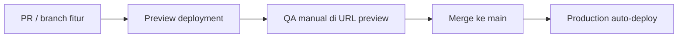
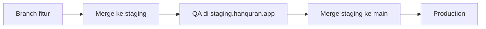

# Deploy & Staging di Vercel — HanQuran

Dokumen ini menjelaskan cara men-deploy HanQuran ke Vercel, membedakan lingkungan **preview / staging / production**, dan checklist uji sebelum rilis. Mengacu pada task Phase 8 di `docs/18-development-tasks.md`.

> **Catatan:** HanQuran adalah aplikasi **static-first** (Next.js + dataset `public/data/`* + Service Worker). Tidak ada server backend khusus; staging dan production memakai build yang sama (`next build`).

---

## 1. Ringkasan lingkungan

| Lingkungan             | Sumber deploy                | URL contoh                                    | Kapan dipakai                            |
| ---------------------- | ---------------------------- | --------------------------------------------- | ---------------------------------------- |
| **Lokal (dev)**        | `npm run dev`                | `http://localhost:3000`                       | Coding harian — **SW & PWA tidak aktif** |
| **Lokal (prod build)** | `npm run build && npm start` | `http://localhost:3000`                       | Uji SW sebelum push                      |
| **Preview**            | Setiap push / PR ke GitHub   | `hanquran-app-git-<branch>-<team>.vercel.app` | Review fitur, QA singkat                 |
| **Staging (opsional)** | Branch tetap `staging`       | `staging.hanquran.app` atau subdomain Vercel  | Uji rilis penuh sebelum `main`           |
| **Production**         | Branch `main`                | `hanquran.app` / `*.vercel.app`               | Pengguna akhir                           |

**“Identik dengan production”** berarti: deployment Vercel dengan **Production build**, bukan dev server. Service Worker terdaftar (`NODE_ENV === 'production'`), manifest PWA aktif, dan perilaku offline dapat diuji.

---

## 2. Setup awal (sekali)

### 2.1 Hubungkan repositori

1. Buat akun [Vercel](https://vercel.com) dan import repo GitHub `hanquran-app`.
2. **Root Directory:** pastikan mengarah ke folder aplikasi (`hanquran-app` jika monorepo, atau root repo jika hanya app).
3. **Framework Preset:** Next.js (deteksi otomatis).
4. **Build Command:** `npm run build` (default).
5. **Output:** default Next.js — tidak perlu static export.

### 2.2 Branch & environment

Di **Project Settings → Git**:

| Branch                                    | Environment Vercel                        |
| ----------------------------------------- | ----------------------------------------- |
| `main`                                    | **Production**                            |
| `staging` (buat jika ingin staging tetap) | **Preview** dengan custom domain opsional |
| Branch fitur / PR                         | **Preview** otomatis                      |

### 2.3 Domain (opsional)

- **Production:** `hanquran.app` → assign di Settings → Domains pada environment Production.
- **Staging:** `staging.hanquran.app` → assign ke branch `staging` (Preview).

Tanpa custom domain, URL `*.vercel.app` sudah cukup untuk MVP.

### 2.4 Environment variables

MVP saat ini **tidak wajib** env vars. Saat Phase 8 (Sentry, analytics) ditambahkan, pisahkan per environment:

| Variabel (contoh masa depan) | Preview / Staging   | Production             |
| ---------------------------- | ------------------- | ---------------------- |
| `NEXT_PUBLIC_SENTRY_DSN`     | DSN project staging | DSN project production |
| `NEXT_PUBLIC_APP_ENV`        | `staging`           | `production`           |

Vercel menyediakan `VERCEL_ENV` (`production` | `preview` | `development`) tanpa konfigurasi manual.

---

## 3. Alur rilis yang disarankan

### Opsi A — Solo / tim kecil (disarankan untuk MVP)

1. Buka PR → Vercel membuat **Preview URL**.
2. Uji checklist §5 di URL preview (build production).
3. Merge ke `main` → **Production** ter-deploy otomatis.
4. Isi release notes dari template `RELEASE.md`.

### Opsi B — Staging tetap sebelum production

Cocok jika ingin URL staging yang tidak berubah setiap PR.

---

## 4. Perilaku khusus HanQuran per lingkungan

| Aspek             | Dev lokal        | Vercel Preview / Staging / Production       |
| ----------------- | ---------------- | ------------------------------------------- |
| Service Worker    | Tidak terdaftar  | Terdaftar                                   |
| Install PWA       | Tidak / terbatas | Penuh di HTTPS                              |
| IndexedDB / Dexie | Per browser      | Per origin (cache terpisah antar subdomain) |
| Dataset Quran     | `public/data/*`  | Sama — ikut build                           |
| Audio tilawah     | CDN eksternal    | Sama                                        |
| Vercel Analytics  | Nonaktif di dev  | Aktif di production (`app/layout.tsx`)      |

**Penting:** Jangan mengandalkan `npm run dev` untuk uji PWA, offline, atau install prompt. Selalu uji di URL Vercel atau `npm run build && npm start`.

---

## 5. Checklist QA sebelum rilis production

Salin checklist ini ke PR atau `RELEASE.md` saat rilis.

### Build & deploy

- [ ] `npm run test` lulus di CI / lokal
- [ ] `npm run build` sukses
- [ ] Preview / staging URL dapat dibuka tanpa error

### Core flows

- [ ] Beranda — daftar surat, cari, filter favorit
- [ ] Surah Detail — audio, repeat, unduh offline
- [ ] Mode Fokus — navigasi ayat
- [ ] Pengaturan — bahasa, qari, ukuran teks, aksesibilitas
- [ ] Lanjutkan Hafalan — posisi terakhir tersimpan

### PWA & offline

- [ ] Manifest valid (DevTools → Application)
- [ ] Service Worker aktif
- [ ] Install prompt / banner (Android Chrome; petunjuk iOS Safari)
- [ ] Mode offline — shell / halaman fallback
- [ ] Minimal 1 surat diunduh dan diputar offline

### Kualitas

- [ ] Lighthouse ≥ 80 (Performance, Accessibility, Best Practices, PWA) — mobile
- [ ] Tidak ada regresi kritis audio / repeat

---

## 6. Rollback cepat

Jika production bermasalah setelah deploy:

1. Buka **Vercel Dashboard → Deployments**.
2. Pilih deployment **sebelumnya** yang stabil → **Promote to Production** (instant rollback).
3. Catat insiden di release notes versi hotfix.

Tidak perlu konfigurasi tambahan untuk rollback di Vercel.

---

## 7. Staged rollout (10% → 50% → 100%)

Vercel **tidak** memiliki staged rollout persentase seperti mobile app store. Untuk web PWA:

| Strategi               | Cara                                                             |
| ---------------------- | ---------------------------------------------------------------- |
| **Canary via preview** | Uji di staging/preview, lalu promote satu deployment production  |
| **Feature flags**      | Post-MVP — subset pengguna (lihat task feature flags)            |
| **Komunikasi**         | Umumkan rilis; pengguna mendapat update saat refresh / SW update |

Dokumentasi strategi detail: task Phase 8 «Susun strategi staged rollout» di `docs/18-development-tasks.md`.

---

## 8. Referensi terkait

| Dokumen                        | Isi                              |
| ------------------------------ | -------------------------------- |
| `docs/SETUP.md`                | Setup developer lokal            |
| `RELEASE.md`                   | Template catatan rilis per versi |
| `docs/20-mvp-freeze.md`        | Kriteria MVP selesai             |
| `docs/18-development-tasks.md` | Task Phase 8                     |

---

Dokumen ini disimpan sebagai `docs/25-deployment-vercel.md`.