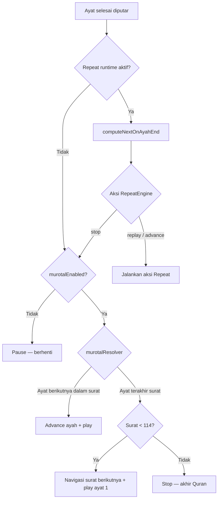

# 29 — Mode Murotal (Pemutaran Berkelanjutan)

**Tanggal:** 25 Juni 2026  
**Status:** ✅ Diimplementasi (v0.3.0)  
**Versi target:** `0.3.0`  
**Backlog:** PB-017  
**Lokasi UI:** `/settings` — bagian **Playback**

---

## 1. Ringkasan

**Mode Murotal** memungkinkan tilawah audio berjalan **berkelanjutan** — ayat demi ayat, surat demi surat — hingga pengguna menghentikannya sendiri.

| Aspek | Nilai |
|-------|-------|
| Field pengaturan | `settings.murotalEnabled` |
| Default | **OFF** (`false`) |
| Kontrol UI | Toggle di Pengaturan → Playback |
| Cakupan | Surah Detail (`/surah/[id]`) dan Focus Mode (`/focus/[id]`) |

Tanpa Mode Murotal (perilaku saat ini): setelah satu ayat selesai diputar, pemutaran **berhenti** — kecuali **RepeatEngine** menginstruksikan replay atau advance **di dalam scope repeat** yang aktif.

---

## 2. Latar Belakang

Pengguna yang ingin **mendengarkan Al-Qur'an secara utuh** (murotal) saat ini harus menekan play pada setiap ayat atau mengandalkan repeat dengan target terbatas. Fitur ini memisahkan kebutuhan **hafalan berulang** (Repeat) dari kebutuhan **tilawah kontinu** (Murotal).

Mode Murotal **bukan** pengganti Repeat — keduanya dapat aktif bersamaan dengan aturan prioritas yang jelas (lihat §6).

---

## 3. Definisi

| Istilah | Arti |
|---------|------|
| **Mode Murotal** | Preferensi global: setelah ayat selesai, lanjut otomatis ke ayat berikutnya atau surat berikutnya |
| **Siklus repeat selesai** | `RepeatEngine` mengembalikan aksi `stop` karena jumlah pengulangan pada scope target telah tercapai |
| **Ayat terakhir (konteks surat)** | Ayat dengan nomor `totalAyahs` pada surat yang sedang dibuka |
| **Surat terakhir** | Surat 114 (An-Nas) — tidak ada surat berikutnya |

---

## 4. Pengaturan

### 4.1 UI

Ditambahkan di section **Playback** (`/settings`), di bawah **Auto Follow Playback**:

```text
Mode Murotal                    [ON / OFF]
Putar tilawah secara berkelanjutan: lanjut ke ayat
berikutnya atau surat berikutnya hingga Anda berhenti.
```

| Field UI | Nilai |
|----------|-------|
| Nama (ID) | Mode Murotal |
| Nama (EN) | Continuous Playback *(atau "Murotal Mode" jika konsisten branding)* |
| Deskripsi | Putar tilawah berkelanjutan hingga dihentikan pengguna |
| Default | OFF |
| Kontrol | `Switch` (`SettingsRow`) |

### 4.2 Persistensi

| Field | Tipe | Default | Tabel Dexie |
|-------|------|---------|-------------|
| `murotalEnabled` | `boolean` | `false` | `settings` |

Migrasi Dexie: backfill `murotalEnabled: false` pada record `settings` yang ada.

Perubahan toggle berlaku **segera** untuk sesi pemutaran berikutnya; tidak memutus audio yang sedang berjalan kecuali implementasi memutuskan flush pada toggle (rekomendasi: **tidak** memutus — berlaku mulai transisi ayat berikutnya).

---

## 5. Perilaku Dasar

### 5.1 Mode Murotal OFF (default)

Identik perilaku **saat ini**:

1. Ayat selesai diputar → jika Repeat aktif, `RepeatEngine` menentukan `replay` / `advance` / `stop`.
2. Jika Repeat tidak aktif atau mengembalikan `stop` → pemutaran berhenti (`pause`).

### 5.2 Mode Murotal ON

Setelah satu ayat selesai diputar:

1. **RepeatEngine dijalankan terlebih dahulu** (jika sesi repeat aktif).
2. Jika hasil RepeatEngine adalah `replay` atau `advance` → ikuti instruksi Repeat (tidak ada perubahan).
3. Jika hasil RepeatEngine adalah `stop` **atau** Repeat tidak aktif → **MurotalResolver** menentukan langkah berikutnya:
   - Bukan ayat terakhir surat → **advance** ke `currentAyah + 1`, putar otomatis.
   - Ayat terakhir surat & bukan surat 114 → **navigasi** ke surat berikutnya (`surahId + 1`), ayat 1, putar otomatis.
   - Ayat terakhir surat 114 → **stop** (akhir Al-Qur'an); tampilkan umpan balik ringkas (toast/status).

Pemutaran berkelanjutan **berhenti** hanya jika:

- Pengguna menekan pause/stop;
- Audio gagal dimuat (offline/CDN error);
- Akhir Al-Qur'an tercapai;
- (Opsional implementasi) pengguna menonaktifkan Mode Murotal **dan** transisi berikutnya belum terjadi.

---

## 6. Interaksi dengan RepeatEngine

Repeat **selalu didahulukan**. Murotal hanya bertindak pada momen Repeat akan **berhenti** atau saat **tidak ada** repeat aktif.

### 6.1 Diagram keputusan



### 6.2 Tabel skenario

| Repeat | Target | Count | Posisi | Murotal | Hasil setelah ayat/siklus selesai |
|--------|--------|-------|--------|---------|-----------------------------------|
| OFF | — | — | Ayat 3/7 | OFF | Stop |
| OFF | — | — | Ayat 3/7 | ON | Lanjut ayat 4 |
| ON | Ayat aktif | 5× | Ayat 3 | OFF | Setelah 5× ayat 3 → stop |
| ON | Ayat aktif | 5× | Ayat 3 | ON | Setelah 5× ayat 3 → lanjut ayat 4 |
| ON | Range 1–5 | 2× | Siklus ke-2 selesai di ayat 5 | OFF | Stop |
| ON | Range 1–5 | 2× | Siklus ke-2 selesai di ayat 5 | ON | Lanjut ayat 6 |
| ON | Surat ini | 1× | Ayat 7/7 (Al-Fatihah) | ON | Lanjut **Al-Baqarah** ayat 1 |
| ON | Ayat aktif | ∞ | Ayat 3 | ON | Tetap di ayat 3 (repeat tidak pernah `stop`) |
| ON | Surat ini | ∞ | Ayat mana pun | ON | Tetap dalam siklus surat (repeat tidak pernah `stop`) |

### 6.3 Prinsip

- **Infinite repeat** (∞) tidak pernah menghasilkan `stop` dari sisi count → Murotal **tidak** mengintervensi hingga repeat diubah/dimatikan.
- Saat Murotal melanjutkan ke ayat/surat berikutnya setelah repeat selesai, **runtime repeat direset** (`isActive: false`) agar ayat baru diputar sekali (kecuali pengguna segera memulai repeat lagi).
- Konfigurasi repeat (`count`, `target`, `range`) **tetap tersimpan** di Dexie — hanya runtime sesi yang berhenti.

---

## 7. Cakupan Layar

| Layar | Mode Murotal |
|-------|----------------|
| Surah Detail | ✅ Berlaku — scroll + highlight ayat aktif; auto follow tetap mengikuti `autoFollowPlayback` |
| Focus Mode | ✅ Berlaku — navigasi antar ayat dalam route `/focus/[id]`; lintas surat → `/focus/[nextId]?ayah=1` |
| Beranda / Pengaturan | ❌ Tidak berlaku |

### 7.1 Lintas surat

| Dari | Ke | Navigasi |
|------|-----|----------|
| `/surah/1?ayah=7` | Al-Baqarah ayat 1 | `router.replace(routes.surah('2', 1))` + play |
| `/focus/1?ayah=7` | Al-Baqarah ayat 1 | `router.replace(routes.focus('2', 1))` + play |

- Perbarui `lastRead` via `usePersistLastViewed` pada setiap transisi.
- Prefetch audio ayat berikutnya tetap memakai `prefetchNextAyah` yang ada.
- Jika audio surat berikutnya belum diunduh offline, coba streaming CDN; jika gagal → stop + pesan error ringkas.

### 7.2 Tombol Previous / Next (transport audio)

Aturan berlaku di **Surah Detail** dan **Focus Mode** (`AudioPlayer` ⏮ / ⏭).

#### Mode Murotal OFF (default)

| Tombol | Kondisi | Aksi |
|--------|---------|------|
| **Previous** | `activeAyah > 1` | Pindah ke ayat `activeAyah - 1` dalam surat yang sama |
| **Previous** | `activeAyah === 1` | **Nonaktif** (disabled) |
| **Next** | `activeAyah < totalAyahs` | Pindah ke ayat `activeAyah + 1` dalam surat yang sama |
| **Next** | `activeAyah === totalAyahs` | **Nonaktif** (disabled) |

Tidak ada navigasi lintas surat dari tombol transport.

#### Mode Murotal ON

| Tombol | Kondisi | Aksi |
|--------|---------|------|
| **Previous** | `activeAyah > 1` | Ayat sebelumnya dalam surat yang sama |
| **Previous** | `activeAyah === 1` dan `surahId > 1` | Navigasi ke **surat sebelumnya**, ayat **terakhir** surat itu |
| **Previous** | `activeAyah === 1` dan `surahId === 1` | **Nonaktif** |
| **Next** | `activeAyah < totalAyahs` | Ayat berikutnya dalam surat yang sama |
| **Next** | `activeAyah === totalAyahs` dan `surahId < 114` | Navigasi ke **surat berikutnya**, **ayat 1** |
| **Next** | `activeAyah === totalAyahs` dan `surahId === 114` | **Nonaktif** |

Lintas surat memakai `router.replace` (`/surah/[id]` atau `/focus/[id]`) + `setPendingMurotalPlay` jika audio sedang diputar — pola sama dengan auto-advance murotal.

#### Media Session (lock screen)

Kontrol **previous track** / **next track** OS mengikuti aturan yang sama (bergantung `settings.murotalEnabled`).

#### Implementasi

| Modul | Tanggung jawab |
|-------|----------------|
| `services/playback-track-navigation.ts` | Pure functions — `resolvePlaybackTrackStep`, `isPlaybackTrackDisabled` |
| `lib/surah-ayah-counts.ts` | Jumlah ayat per surat (1–114) untuk prev lintas surat |
| `useSurahRepeatPlayback` | `goToPreviousTrack`, `goToNextTrack`, flag disabled |

---

## 8. Arsitektur (Rencana Implementasi)

### 8.1 Modul baru

| Modul | Tipe | Tanggung jawab |
|-------|------|----------------|
| `services/murotal-resolver.ts` | Pure functions | Hitung aksi setelah ayat selesai & murotal ON |
| `services/playback-track-navigation.ts` | Pure functions — aturan ⏮/⏭ transport |
| `lib/surah-ayah-counts.ts` | Metadata jumlah ayat per surat |
| `hooks/use-surah-repeat-playback.ts` | Hook (update) | Orkestrasi RepeatEngine → MurotalResolver → audio/navigation |
| `settings.murotalEnabled` | Dexie + `useUserStore` | Preferensi persisten |

### 8.2 Tipe aksi (usulan)

```ts
type MurotalAction =
  | { type: 'advance_ayah'; ayahNumber: number }
  | { type: 'advance_surah'; surahId: number; ayahNumber: 1 }
  | { type: 'stop'; reason: 'user_end' | 'quran_complete' | 'audio_error' };
```

```ts
function resolveMurotalAfterAyahEnd(params: {
  surahId: number;
  currentAyah: number;
  totalAyahs: number;
  totalSurahs?: number; // default 114
}): MurotalAction;
```

### 8.3 Integrasi dengan `useSurahRepeatPlayback`

Pseudocode pada `handleAyahEnded`:

```ts
const repeatResult = computeNextOnAyahEnd(...);

if (repeatResult.action.type === 'replay' || repeatResult.action.type === 'advance') {
  // jalankan seperti sekarang
  return;
}

// action === 'stop' atau repeat tidak aktif
if (!settings.murotalEnabled) {
  pause();
  return;
}

const murotal = resolveMurotalAfterAyahEnd({ surahId, currentAyah, totalAyahs });
// jalankan advance_ayah / advance_surah / stop + navigasi jika perlu
```

**Tidak** mengubah `RepeatEngine` — logika murotal terpisah agar tetap pure dan teruji.

---

## 9. State Management

| Field | Pemilik | Persisten |
|-------|---------|-----------|
| `murotalEnabled` | `useUserStore.settings` | Ya (Dexie `settings`) |
| Runtime murotal | — | Tidak ada state runtime khusus; mengikuti `isPlaying` + posisi ayat |

Lihat pembaruan `docs/06-database-schema.md` §5.8 dan `docs/15-state-management.md`.

---

## 10. Analytics

| Event | Pemicu | Status |
|-------|--------|--------|
| `murotal_enabled` | Pengguna mengaktifkan toggle (edge: hanya saat OFF→ON) | ✅ |
| `murotal_surah_complete` | Murotal selesai satu surat penuh dan lanjut ke surat berikutnya | ✅ |
| `murotal_quran_complete` | Mencapai akhir An-Nas dalam satu sesi murotal | ✅ |

Lihat `docs/analytics.md`.

---

## 11. Kriteria Penerimaan (PB-017)

- [x] Toggle **Mode Murotal** di `/settings` → Playback, default OFF, persisten di Dexie.
- [x] OFF: perilaku identik dengan rilis sebelum fitur ini.
- [x] ON: setiap ayat selesai (tanpa repeat aktif) → lanjut ayat berikutnya otomatis.
- [x] ON + repeat `current_ayah` N×: setelah N selesai → lanjut ayat berikutnya (bukan stop).
- [x] ON + repeat range/surat: setelah siklus terakhir selesai di ayat akhir scope → lanjut ayat **setelah** scope (atau surat berikutnya jika ayat terakhir surat).
- [x] ON: ayat terakhir surat → surat berikutnya ayat 1 (Surah Detail & Focus Mode).
- [x] ON: ayat terakhir An-Nas → stop + umpan balik.
- [x] ON + repeat ∞: tidak keluar dari scope repeat sampai pengguna mengubah pengaturan atau pause.
- [x] `lastRead` terupdate pada setiap transisi.
- [x] Unit test `murotal-resolver.ts` + orkestrasi repeat+murotal.
- [x] Aturan transport ⏮/⏭ — §7.2 (`playback-track-navigation.ts`).
- [ ] Uji manual lintas surat & regresi Media Session (belum diverifikasi penuh).

---

## 12. Di Luar Cakupan (v0.3.0)

- Putar otomatis **tanpa** pernah membuka Surah Detail (mulai dari Beranda).
- Kecepatan pemutaran / pitch qari.
- Jadwal sleep timer.
- Murotal lintas **qari** otomatis.
- Sinkronisasi murotal lintas tab (di luar `AudioTabSync` yang ada).

---

## 13. Dokumen Terkait

| Dokumen | Perubahan |
|---------|-----------|
| `docs/28-playback-settings.md` | Toggle Mode Murotal di section Playback |
| `docs/06-database-schema.md` | Field `murotalEnabled` |
| `docs/15-state-management.md` | Preferensi playback |
| `docs/02-product-backlog.md` | PB-017 |
| `docs/03-user-stories.md` | User story murotal |
| `docs/12-component-spec.md` | Settings Playback rows |
| `docs/08-ui-ux-wireframe.md` | Wireframe Pengaturan |
| `docs/18-development-tasks.md` | Task implementasi Phase |
| `docs/17-implementation-roadmap.md` | Milestone 0.3.0 |
| `docs/20-mvp-freeze.md` | Catatan post-MVP |
| `RELEASE.md` | Rencana v0.3.0 |
| `docs/analytics.md` | Event murotal |
| `docs/05-module-catalog.md` | Modul Settings — playback |
| `docs/14-routing-spec.md` | Aksi pengaturan di `/settings` |
| `docs/16-folder-structure.md` | `services/murotal-resolver.ts` |
| `docs/24-focus-mode-mvp-scope.md` | Murotal di Focus Mode |
| `docs/22-verse-display-controls.md` | Pemisahan kontrol vs Pengaturan |
| `docs/19-document-audit.md` | Registrasi dokumen baru |

---

## 14. Catatan Implementasi

- Versi `package.json` **belum** dinaikkan — naik ke `0.3.0` saat fitur dirilis.
- Label UI wajib Bahasa Indonesia (kecuali proper noun); key i18n: `settings.playback.murotalEnabled`, `settings.playback.murotalEnabledDescription`.
- Pengujian manual: Al-Fatihah → Al-Baqarah dengan murotal ON; kombinasi repeat 5× + murotal ON di tengah surat.
